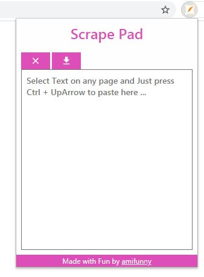

# Scrape-Pad-Browser-Extension
**Chrome Extension to quickly note down written stuff from websites and prepare a document with all reference links.**

It has a simple UI to create text files from bits and pieces of text selected and pasted.
**Use Ctrl+Up to seemlessly copy and paste into your extension text pad.**

Not on Chrome Store. But if you want to use, follow these steps.
1) Go to `More tools` using menu button on top-right.

2) Hover and Click `Extensions`.
or Simply type `chrome://extensions` in url bar.

3) Turn on `Developer mode`.

4) Click `Load Unpacked` and select the cloned Repository.

There you go. Feel free to tweak changes and submit PR.
